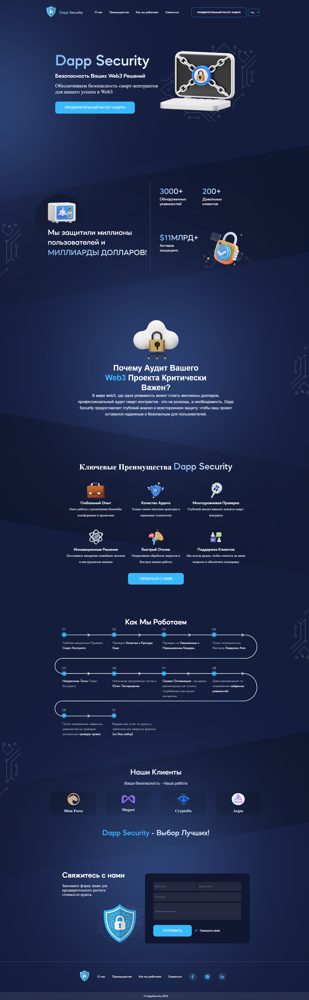

# Dapp Security Lending Page
<h2>About the project</h2>

<b>Dapp Security</b> is a Web3 audit company focused on enhancing the security of smart contracts and blockchain projects. 

The landing page for Dapp Security is designed with a responsive layout ensuring optimal viewing across various devices and screen sizes. 

This landing page features a contact form that directly submits its data to a Telegram channel in accordance with the Technical Specification. This ensures instant communication and interaction with the team, allowing for prompt responses to inquiries and audit assessments. 

👉 Live site: <a href='https://dappsecurity.tech/'>Dapp Security</a>

<h3>Build with:</h3>

» Vanilla JS  
» Vanilla CSS  
» Vanilla CSS Animation  

 

<h2>Screenshots of the Project 📸</h2>
 
<h3 align='center'>Main Page 🏡</h3>

